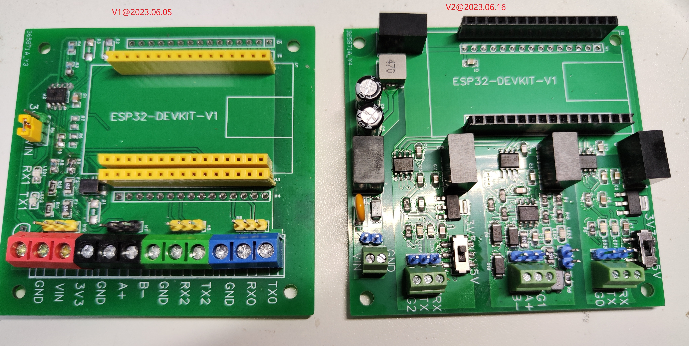

立创EDA专业版 项目文件和元件库文件

-------

# 供电

## 防反接

自恢复保险丝+二极管

## 防过压

+ 气体放电管
+ TVS二极管 SMBJ6.5CA等
+ 宽电压支持

## 隔离

+ 有个外壳
+ 大功率时要有散热
+ 电路板涂胶防水

## 降压

+ 芯片
  LM2576
  MP1584EN
+ 模块
  金升阳DC-DC电源模块，如WRB0503S-1WR2，4.5~
  9v输入，3.3v输出，功率1W，[WRB0503S-1WR2_规格书](/doc/电子元件手册/电源/C5832159_电源模块_WRB0503S-1WR2_规格书_MORNSUN(金升阳)电源模块规格书.PDF)

## 升压

## 稳压

LDO三端线性稳压 AMS1117

# 通信

## TTL 3.3V和5V电平兼容

[3.3V与5V系统电平兼容的方法探究](https://blog.csdn.net/RF_star/article/details/105838726)

MOS管 https://blog.csdn.net/qq_44711012/article/details/121843559

## RS485-TTL转换

用MAX13487可以替代MAX485，自动改变串口数据流向

MAX485+三极管，可以自动改变串口数据流向

## 信号隔离、电磁兼容

电源隔离和信号隔离都有才能起到隔离作用

信号隔离可以使用光耦隔离（需要考虑开关频率和通信带宽的匹配），也可以用专用隔离芯片

常用数字隔离器芯片有：ADUM1201、ADUM5241、ISO7221和Si8421等
注意：设计串口隔离电路时，不仅串口通信线TX和RX需要隔离，两侧的电源和地也需要隔离，否则隔离就没有意义了。
ADUM1201：
● 隔离器的技术构架：Magnetic Coupling
●类型：General Purpose
●通道数：2
●通道类型：Unidirectional
●隔离电压：2500Vrms
●数据速率：10Mbps
ADUM5241：
●隔离器的技术构架：Magnetic Coupling
●类型：General Purpose
●通道数：2
●通道类型：Unidirectional
●隔离电压：2500Vrms
●数据速率：1Mbps
ISO7221：
●隔离器的技术构架：Capacitive Coupling
●类型：General Purpose
●通道数：2
●通道类型：Unidirectional
●隔离电压：2500Vrms
●数据速率：150Mbps
Si8421：
●隔离器的技术构架：Capacitive Coupling
●类型：General Purpose
●通道数：2
●通道类型：Unidirectional
●隔离电压：2500Vrms
●数据速率：150Mbps
还有隔离电压比较高的，对隔离电压要求高的可以考虑一下这个系列的芯片
π121M31：
●隔离器的技术构架：iDivider
●通道数：2
●隔离电压：3000Vrms
●数据速率：10Mbps
π122U31：
●隔离器的技术构架：iDivider
●通道数：2
●隔离电压：3000Vrms
●数据速率：150kbps
————————————————
版权声明：本文为CSDN博主「永不停歇的水手」的原创文章，遵循CC 4.0 BY-SA版权协议，转载请附上原文出处链接及本声明。
原文链接：https://blog.csdn.net/weixin_42906535/article/details/123869661

USB隔离只能用ADuM3160

PCB上，Tx/Rx要有指示灯，MAX485等芯片的控制角可选单片机控制和三极管控制

## 3.3~5.0V TTL 宽电压支持

+ 方案1.

+ 方案2. 电平转换

TXS0101 1通道全双工双向电平转换
SN74AVC1T45

+ 方案3. 使用支持宽电压TTL的串口芯片

# PCB版本记录

## v2 @ 2023.06.15

主要特性和调试结果

+ 使用π122U31和B0505S-1WR3，实现了ESP32、串口0、RS485（串口1）和串口2的互相隔离通信，不会因为共地导致干扰和烧元件
+ B0505的输出电压为5.29-5.30V
+ 使用π122U31和AMS1117-3.3，实现了TTL电平可选3.3V和5V
+ 使用K7805-500R3实现了6.5-36V宽电压输入，实测电流67mA@6.0V，63mA@6.5V，47mA@9.0V，35mA@12.0V，30mA@18V，16mA@24V，12mA@32V
+ LED标识的正负极与实际相反
+ 接收或者发送时，对应的LED会闪烁
+ TTL转RS485芯片使用的是MAX13487EESA+，可以自动收发，但是似乎驱动能力较弱。  
  RS485输出无负载时，示波器观察得知AB差的高值4.8V，低值约-5.1V，上升沿时间长；接1.3kΩ电阻时，高值0.6V，低值-5V。  
  需要尝试其他转换方案

  
  

## v1 @ 2023.06.05

+ 引出了三个串口，分别用于调试、和PLC进行RS485通讯、和3D打印机TTL通信
+ 测试发现，用USB给PCB板供电时，接入示波器会导致板上的Rx或Tx灯常亮，判断是共地干扰