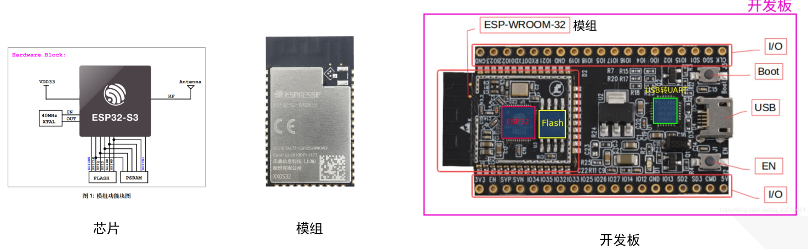
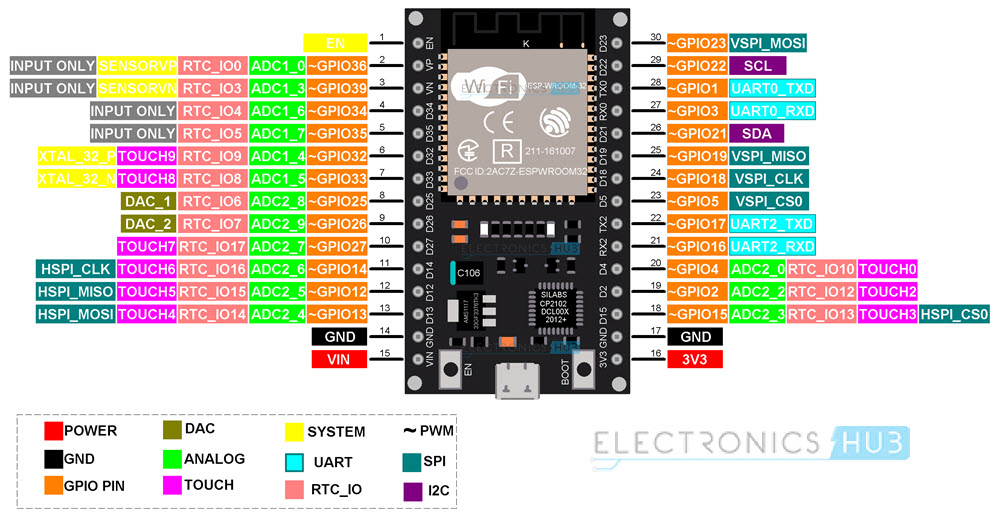
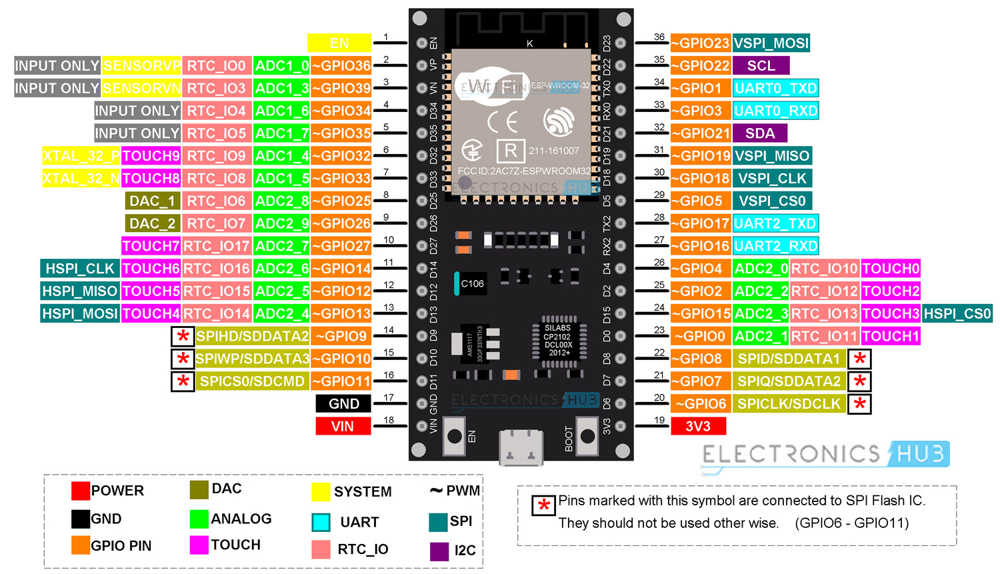
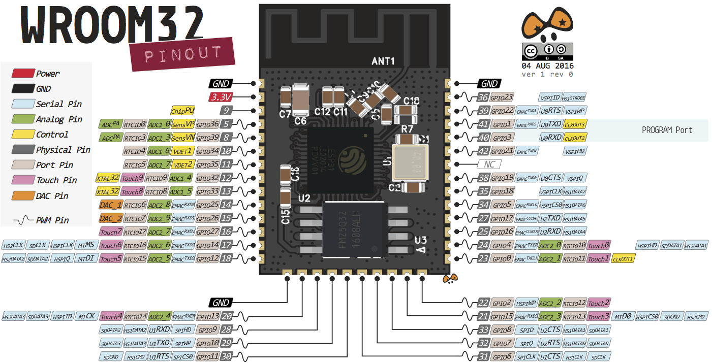

# 开发文档梳理

关于芯片、模组、开发板的定义  

ESP32 30pin开发板外观和管脚功能  

ESP32 36pin开发板外观  

ESP32-WROOM-32芯片管脚定义  

**注意：** [ESP32-WROOM-32技术规格书](/doc/乐鑫官方技术文档/esp32-wroom-32_datasheet_cn.pdf)第27页写道：

> ESP32-WROOM-32集成了4MB的SPI flash，连接ESP32的管脚 GPIO6，GPIO7，GPIO8，GPIO9，GPIO10和GPIO11。这六个管脚不建议用于其他功能。

## 不建议使用或限制使用的引脚

+ 不建议使用 Strapping引脚 ，SPI flash 引脚 以及 仅输入的引脚

Strapping 引脚
GPIO 0
GPIO 2
GPIO 4
GPIO 5 (启动时必须为高电平)
GPIO 12 (启动时必须为低电平)
GPIO 15 (启动时必须为高电平)

注意：

在硬件上要注意使用外接模块时不能将GPIO12拉高，否则将导致ESP32启动异常。还有一些GPIO在启动或重置时其状态更改为高或者输出PWM信号，在使用时需要注意。

+ 集成在ESP-WROOM-32 的 SPI flash 引脚
  GPIO 6 到 GPIO 11 在一些 ESP32 开发板中公开。但是，这些引脚连接到 ESP-WROOM-32 芯片上的集成 SPI
  闪存，不推荐用于其他用途。所以，不要在你的项目中使用这些引脚：

GPIO 6 (SCK/CLK)
GPIO 7 (SDO/SD0)
GPIO 8 (SDI/SD1)
GPIO 9 (SHD/SD2)
GPIO 10 (SWP/SD3)
GPIO 11 (CSC/CMD)

+ 仅输入引脚
  GPIO 34 到 39 是 GPI – 仅输入引脚。这些引脚没有内部上拉或下拉电阻。它们不能用作输出，因此只能将这些引脚用作输入：

GPIO 34
GPIO 35
GPIO 36
GPIO 39

这些引脚都是ESP32用于引导加载程序或者烧录模式/在大多数内置USB/Serial的开发板上，不需要担心这些引脚的状态，开发板会把这些引脚设置为正确的状态，以便使用烧录或启动模式。

# Reference

ESP32-WROOM-32资料

[ESP32-WROOM-32技术规格书](乐鑫官方技术文档/esp32-wroom-32_datasheet_cn.pdf)  
[ESP32硬件设计指南](乐鑫官方技术文档/esp32_hardware_design_guidelines_cn.pdf)  
[ESP32技术参考手册](乐鑫官方技术文档/esp32_technical_reference_manual_cn.pdf)  
[ESP32 ESP-IDF编程指南](乐鑫官方技术文档/ESP-IDF-Programming-Guide-zh_CN-v5.2-dev-823-g903af13e84-esp32.pdf)

其他乐鑫资料

[技术文档](https://www.espressif.com.cn/zh-hans/support/documents/technical-documents)  
[技术参考手册 (PDF)](https://www.espressif.com/sites/default/files/documentation/esp32_technical_reference_manual_cn.pdf)  
[技术规格书 (PDF)](https://espressif.com/sites/default/files/documentation/esp32_datasheet_cn.pdf)  
[硬件设计指南 (PDF)](https://espressif.com/sites/default/files/documentation/esp32_hardware_design_guidelines_cn.pdf)  
[勘误表及解决方法 (PDF)](https://espressif.com/sites/default/files/documentation/eco_and_workarounds_for_bugs_in_esp32_cn.pdf)  
[芯片变型](https://espressif.com/zh-hans/products/socs?id=ESP32)  
[模组](https://www.espressif.com/zh-hans/products/modules?id=ESP32)  
[开发板](https://www.espressif.com/zh-hans/products/devkits?id=ESP32)  
[乐鑫 KiCad 库](https://github.com/espressif/kicad-libraries)  
[乐鑫产品选型工具](https://products.espressif.com/#/product-selector?names=)  
[乐鑫产品证书](https://www.espressif.com/zh-hans/certificates?keys=ESP32)  
[芯片系列对比](https://products.espressif.com/#/product-comparison)  
[官方论坛硬件版块](https://www.esp32.com/viewforum.php?f=30)