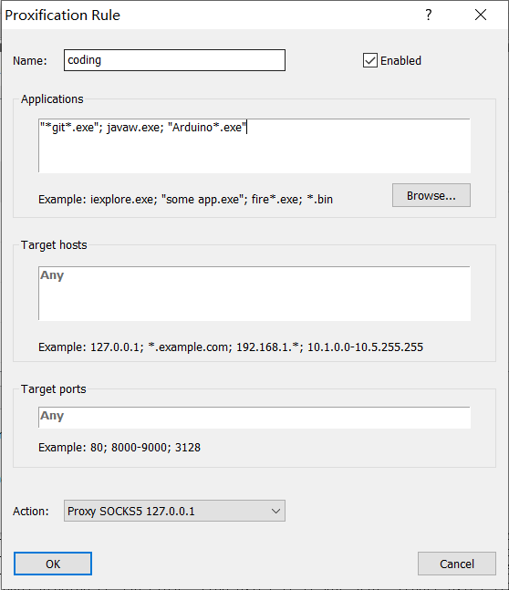
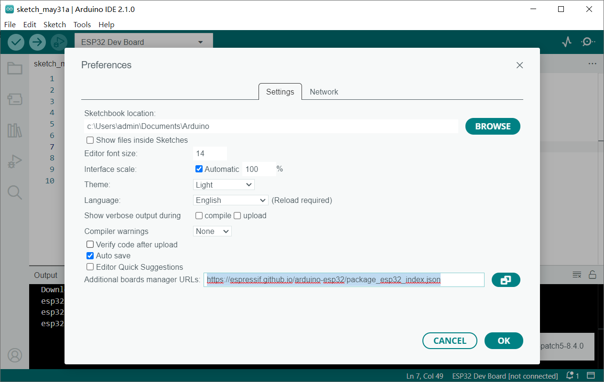
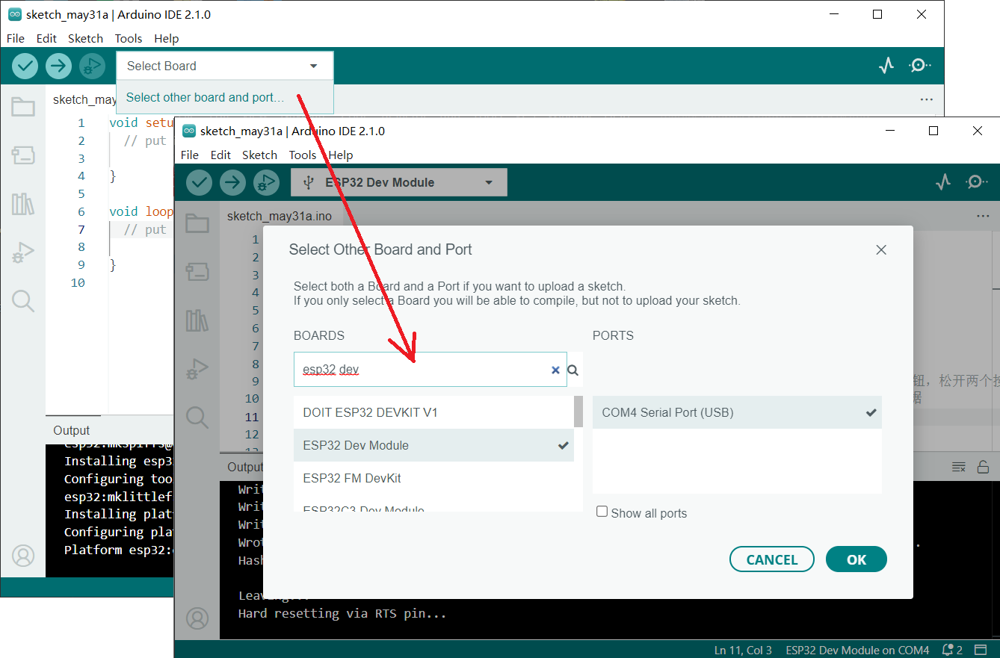
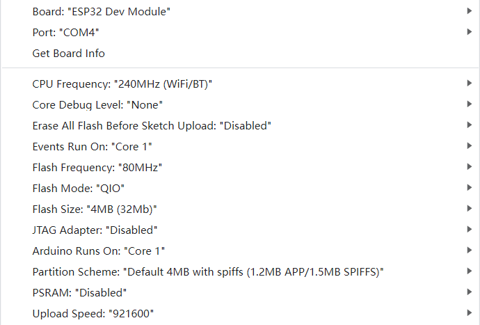

# 项目开发记录

# 安装开发环境

## arduino

### 1. 安装Arduino IDE

到官网https://www.arduino.cc/en/software 下载安装包。
出于备份角度，使用[Portable版本的Arduino IDE](https://downloads.arduino.cc/arduino-ide/arduino-ide_2.1.0_Windows_64bit.zip)
，解压到数据盘，运行`Arduino IDE.exe`，会联网，显示界面比较慢。在proxifier里设置代理可以减少加载时间，以及可以加快后续下载文件的速度。



### 2. 配置ESP32开发环境

在`File -> Preference... -> Additional boards manager URLs`
添加链接`https://espressif.github.io/arduino-esp32/package_esp32_index.json`



点击OK之后自动开始联网加载开发板信息。连接开发板，展开`Select Board`，点击`Select other board and port...`
，搜索`ESP32 Dev Module`，选择对应的开发板（以下操作基于ESP32-WROOM-32）和端口，



### 3. 烧录程序测试

硬件连接正确后，打开`test-led-and-serials.ino`，点击菜单的`Upload`，烧录完成后按一下开发板上的En键或者拔插开发板的供电，可以看到LED在闪烁，
在三个串口也能接收到数据。

> 如果用MicroUSB连接电脑和开发板，需要确保使用的线缆有数据传输功能，且**安装了合适的驱动**，否则无法烧录。  
> 如果通过USB转TTL工具连接电脑和开发板，则串口工具的Tx接开发板的Rx0，串口工具的Rx接开发板的Tx0，Arduino编译好上传，控制台显示Connect...时，
> 先按住Boot，再按一下En，同时松手后才会烧录

烧录过程中Arduino IDE控制台显示的信息如下

```text
Sketch uses 261125 bytes (19%) of program storage space. Maximum is 1310720 bytes.
Global variables use 22352 bytes (6%) of dynamic memory, leaving 305328 bytes for local variables. Maximum is 327680 bytes.
esptool.py v4.5.1
Serial port COM4
Connecting...............
Chip is ESP32-D0WD-V3 (revision v3.0)
Features: WiFi, BT, Dual Core, 240MHz, VRef calibration in efuse, Coding Scheme None
Crystal is 40MHz
MAC: 24:d7:eb:0f:ab:44
Uploading stub...
Running stub...
Stub running...
Changing baud rate to 921600
Changed.
Configuring flash size...
Flash will be erased from 0x00001000 to 0x00005fff...
Flash will be erased from 0x00008000 to 0x00008fff...
Flash will be erased from 0x0000e000 to 0x0000ffff...
Flash will be erased from 0x00010000 to 0x0004ffff...
Compressed 18960 bytes to 13073...
Writing at 0x00001000... (100 %)
Wrote 18960 bytes (13073 compressed) at 0x00001000 in 0.5 seconds (effective 300.0 kbit/s)...
Hash of data verified.
Compressed 3072 bytes to 146...
Writing at 0x00008000... (100 %)
Wrote 3072 bytes (146 compressed) at 0x00008000 in 0.0 seconds (effective 589.5 kbit/s)...
Hash of data verified.
Compressed 8192 bytes to 47...
Writing at 0x0000e000... (100 %)
Wrote 8192 bytes (47 compressed) at 0x0000e000 in 0.1 seconds (effective 762.1 kbit/s)...
Hash of data verified.
Compressed 261488 bytes to 145203...
Writing at 0x00010000... (11 %)
Writing at 0x0001d7ce... (22 %)
Writing at 0x00024f34... (33 %)
Writing at 0x0002a1d1... (44 %)
Writing at 0x0002f5e4... (55 %)
Writing at 0x000357bc... (66 %)
Writing at 0x0003fcc1... (77 %)
Writing at 0x00045a33... (88 %)
Writing at 0x0004af54... (100 %)
Wrote 261488 bytes (145203 compressed) at 0x00010000 in 2.4 seconds (effective 879.2 kbit/s)...
Hash of data verified.

Leaving...
Hard resetting via RTS pin...
```

烧录时的配置为：



## 一些神奇的bug

通过示波器和串口工具调试，发现arduino的delay()至少需要9才能观察到延时

示波器似乎不隔离，示波器的地线接入到 *RS485转TTL模块(红板)* 的A+，会导致板上的LED_RXD灯常亮

示波器地线接入 *RS485转TTL模块(大蓝板)* 的B-，会导致通讯产生误码

正常通讯时，USB转串口工具的TX接 *RS485转TTL模块(大蓝板)* 的TX，无需交叉

ESP32烧录程序后，通过type C USB连接电脑，D18和D19只连接杜邦线（Serial1），会一直输出CRC错误，可能是周围电磁干扰严重。
因此电路上需要有隔离、屏蔽等抗干扰措施。

蓝色透明的USB转RS485工具，不能正常收发，导致调试一直不通。另外红色的RS485转TTL模块也不能工作。